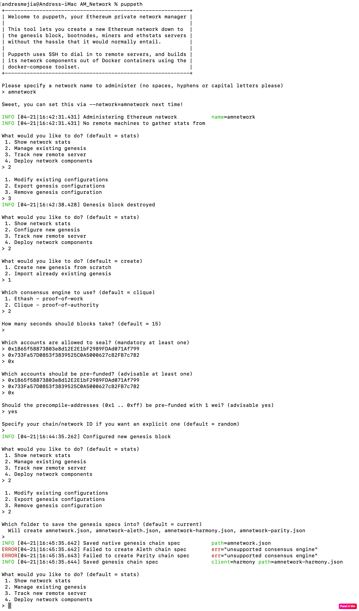
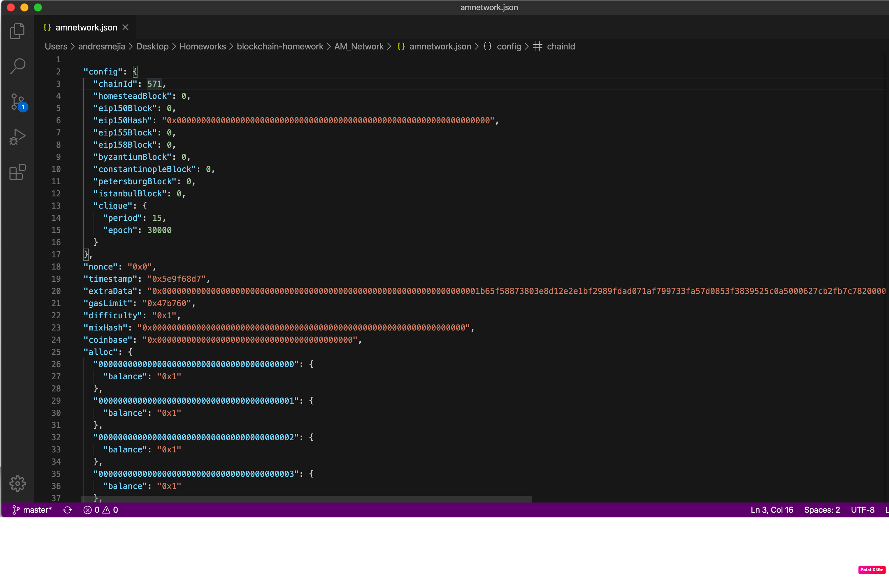
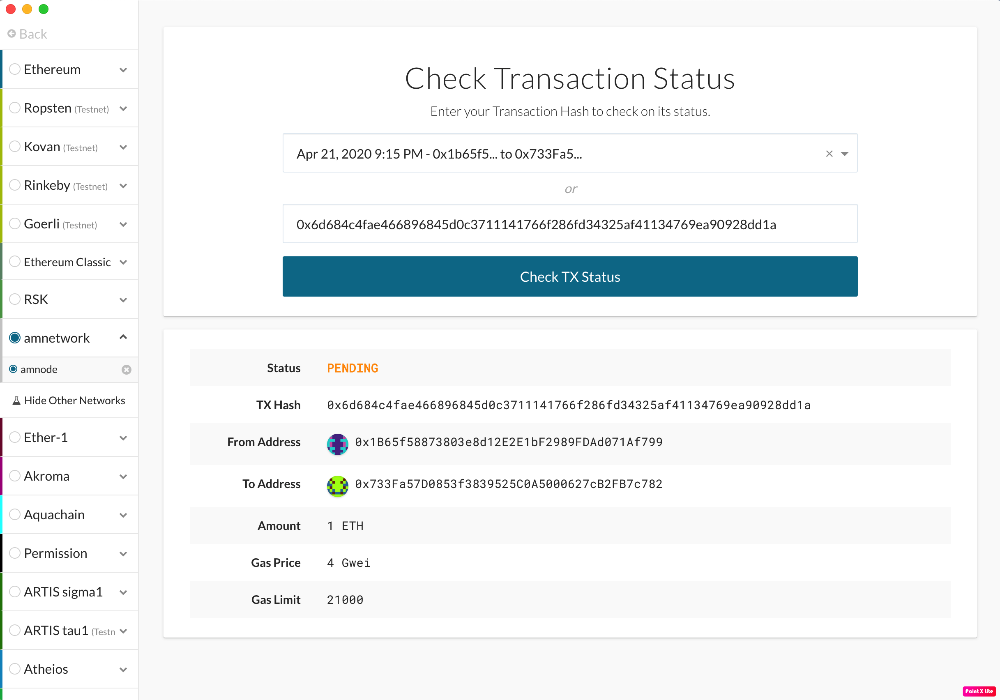

# Proof of Authority Development Chain

## Instructions

The following steps were persormed to create the network (amnetwork) and the nodes (node1 and node2):

1. Inside the directory AM_Network:

  a. Create the node1:
  
      geth account new --datadir node1
      Pswd: node1pswd
      Public Address: 0x1B65f58873803e8d12E2E1bF2989FDAd071Af799
      Path of the secret key file: node1/keystore/UTC--2020-04-21T04-08-42.804293000Z-1b65f58873803e8d12e2e1bf2989fdad071af799
      
  b. Create the node2:
  
      geth account new --datadir node2
      Pswd: node2pswd
      Public Address: 0x733Fa57D0853f3839525C0A5000627cB2FB7c782
      Path of the secret key file: node2/keystore/UTC--2020-04-21T04-09-27.759705000Z-733fa57d0853f3839525c0a5000627cb2fb7c782

  c. Create the network amnetwork:
  
      puppet
      with the following setup:
      
 
 
  
  
  d. Init the nodes:
      
      once created, In a separate Terminal Window, in the AM_Network directory, run the init comads for the nodes:
      
      geth init amnetwork.json --datadir node1
      geth init amnetwork.json --datadir node2
    
  e. Run the first node, unlock the account (password node1pswd), enable mining:
  
      geth --datadir node1 --mine --minerthreads 1 --unlock 0x1B65f58873803e8d12E2E1bF2989FDAd071Af799
      
  f. In a differtent Terminal Window, run the second node with --rpc (HTTP access) enable, a different peer port (30304), and use the first node's `enode` address as the `bootnode` flag:
  
      geth --datadir node2 --port 30304 --rpc --mine --minerthreads 1 --bootnodes " enode://f3e21fd5b447903ac0148f25273c66acf3fb93c72012df1b6bcbaedce0214afeaca51b7510a365bcdaed6c055f83929c4af83933014f7bd74a6bcd44e82a5a47@127.0.0.1:30303"
      
      
2. Send a test transaction:

Using MyCrypto GUI wallet:

  a. connect to the node with the exposed RPC port, using a custom network, and include the chain ID (571) from amnetwork.json, and use ETH as the currency.
  
  b. Import the keystore file from the `node1/keystore` directory into MyCrypto. This will import the private key.
  
  c. Send a transaction from the `node1` account to the `node2` account. Here the Transaction Hash:
  
      TX Hash:0x6d684c4fae466896845d0c3711141766f286fd34325af41134769ea90928dd1a
      
   and here the TX staus:
      
   

3. Inside the directory AM_Network there are all the files created - repository -
